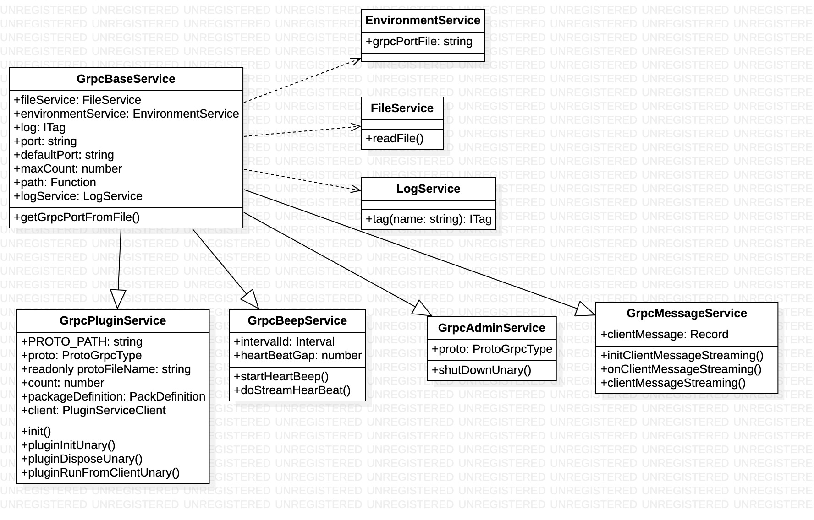

What

gRPC 是由谷歌提出并开发的 RPC 协议，gRPC 提供了一套机制，使得应用程序之间可以进行通信。 降级开发者的使用门槛，屏蔽网络协议，调用对端的接口就像是调用本地的函数一样。而 gRPC 的核心组成部分则是 protocol buffers 和 http2.0
背景和目标

以前 factory 是直接与 engine 通信 然后由 engine 与 c#通信调用 调用 window 底层的动态链接库方法
这种方式调用链路长 不利于排查问题

核心需求/功能

由 factory 直接与 c#通信 解决通信链路长 排查问题不方便 方便后续扩展

现状和问题分析

技术方案设计

 1、架构总览：

 2、核心流程介绍

 3、类图设计：

 4、代码实现

[ClientGrpcBeepService](ClientGrpcBeepService.ts)  
[ClientGrpcAdminService](ClientGrpcAdminService.ts)  
[ClientGrpcPluginService](ClientGrpcPluginService.ts)  
[ClientGrpcMessageService](ClientGrpcMessageService.ts.ts)  
[ClientGrpcMessageService](taskQueue/brower/TaskQueueService.ts)  
[FileService](taskQueue/brower/FileService.ts)

