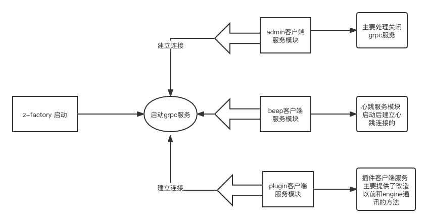
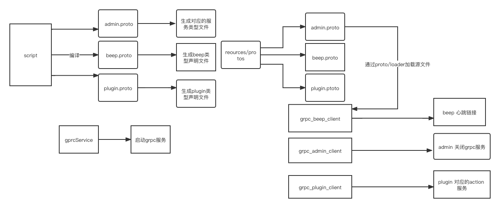

What

gRPC 是由谷歌提出并开发的 RPC 协议，gRPC 提供了一套机制，使得应用程序之间可以进行通信。 降级开发者的使用门槛，屏蔽网络协议，调用对端的接口就像是调用本地的函数一样。而 gRPC 的核心组成部分则是 protocol buffers 和 http2.0
背景和目标
以前 factory 是直接与 engine 通信 然后由 engine 与 c#通信调用 调用 window 底层的动态链接库方法
这种方式调用链路长 不利于排查问题

核心需求/功能

由 factory 直接与 c#通信 解决通信链路长 排查问题不方便 方便后续扩展

现状和问题分析

技术方案设计

● 1、架构总览：
[架构总览](1.png)

    

● 2、核心流程介绍
[核心流程](2.png)

    

● 3、详细设计：

[ClientGrpcBeepService](ClientGrpcBeepService.ts)  
[ClientGrpcAdminService](ClientGrpcAdminService.ts)  
[ClientGrpcPluginService](ClientGrpcPluginService.ts)  
[ClientGrpcMessageService](ClientGrpcMessageService.ts.ts)  
[ClientGrpcMessageService](taskQueue/brower/TaskQueueService.ts)  
[FileService](taskQueue/brower/FileService.ts)

● 异常处理：针对流程上下游和有交接的地方需要充分考虑异常和边界情况（考虑非正常操作情况），并设计相应的处理方式，

列出解决网站加载慢的具体措施，分别描述每个模块/措施的技术实现

接口设计
● 与外部模块有交互时需要给出接口设计，包括交互方式、通信格式、错误处理（错误码）等

如果是提供给外部调用或与后端有通信，需要给出接口通信（或 API）的调用说明
风险预估
● 罗列可能出现的问题及风险点和对应的解决措施
● 可参考这几点：稳定性、兼容性、性能、扩展性、安全性

进度计划安排
● 拆分需求开发
● 设置优先级
● 评估每个需求时间
